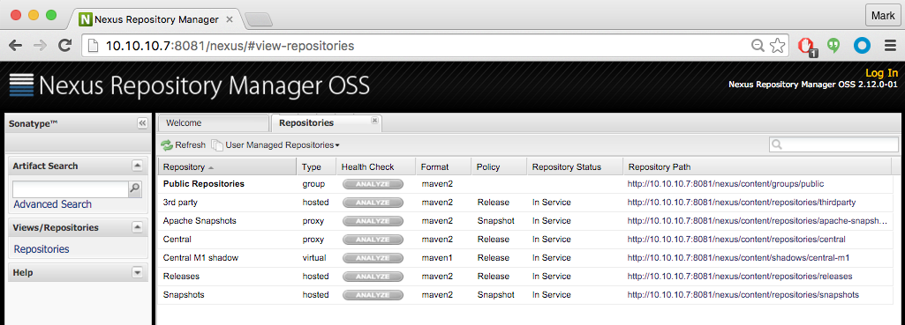
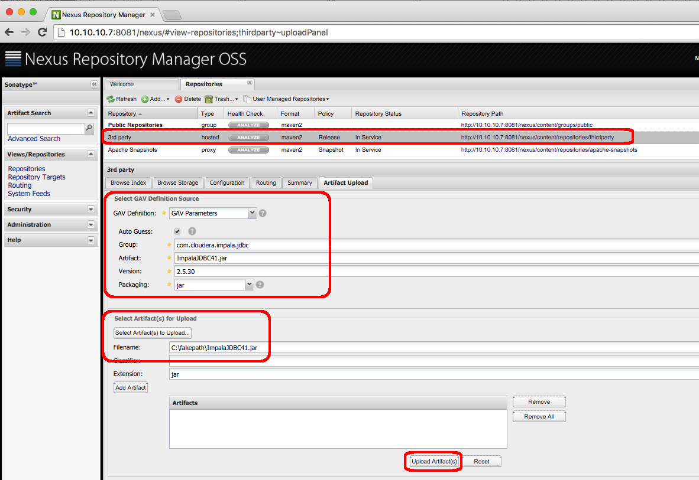
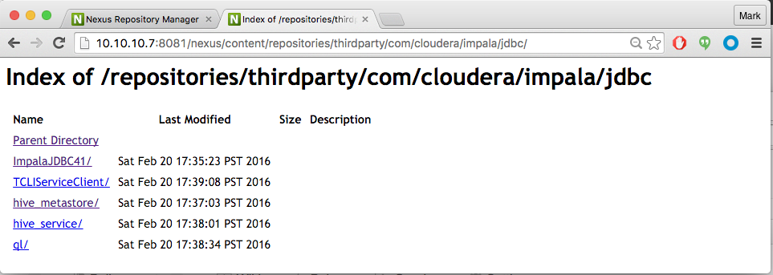
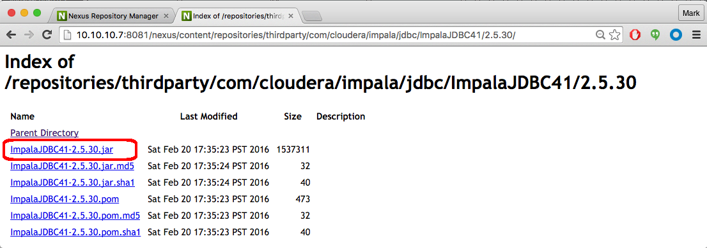

###Cloudera Impala JDBC Example

[Apache Impala (Incubating)](http://www.cloudera.com/products/apache-hadoop/impala.html) is an open source, analytic MPP database for Apache Hadoop.

This example shows how to build and run a Maven-based project to execute SQL queries on Impala using JDBC

I tested using Impala 2.3.x included with [CDH 5.5.x](http://www.cloudera.com/downloads/cdh/5-5-2.html) and the [Impala JDBC Driver v2.5.30](http://www.cloudera.com/downloads/connectors/impala/jdbc/2-5-30.html)

When you download the Impala JDBC Driver from the link above, it is packaged as a zip file with separate distributions for JDBC3, JDBC4 and JDBC4.1.  This example uses the distribution for JDBC4.1 on RHEL6 x86_64.  The downloaded zip file contains the following eleven jar files:

	(1)  ImpalaJDBC41.jar
	(2)  TCLIServiceClient.jar
	(3)  hive_metastore.jar
	(4)  hive_service.jar
	(5)  ql.jar
	(6)  libfb303-0.9.0.jar
	(7)  libthrift-0.9.0.jar
	(8)  log4j-1.2.14.jar
	(9)  slf4j-api-1.5.11.jar
	(10) slf4j-log4j12-1.5.11.jar
	(11) zookeeper-3.4.6.jar

The JDBC driver's installation instructions say only that "...you must set the class path to include all the JAR files from the ZIP archive containing the driver that you are using..."

While this works fine for one-off projects, it's a little loose for shops that would rather manage their dependencies using Maven or other build systems. 

Part of the challenge in building a project using those jars with Maven is that some of the jars are not available in public repos and some of them do not have obvious version numbers.  My approach in this example will be to use a local Maven repo to manage the first five jars in the list above and to rely on publicly available Maven repos for jars 6 - 11 (as they have version numbers in their name). 
I will use the community version of the [Nexus Repository Manager OSS](http://www.sonatype.org/nexus/go/) as a local Maven repo

I downloaded Nexus Repository Manager OSS v2.12 from the link [here](http://www.sonatype.org/nexus/go/) and followed the installation instructions [here](http://books.sonatype.com/nexus-book/reference/installing.html) 

Here is the view of my local Nexus repo available after launching it for the first time.  Note there is already a repo named "3rd party" which I will use to manage the first five JDBC driver jars:  

To add jars to the repo, login to Nexus, go to the 3rd party repo's "upload artifacts" tab and select the desired jar to upload.  I specified a group of "com.cloudera.impala.jdbc" and a version number of "2.5.30" for each of the five jars I uploaded, like this:

Click on the 3rd party repo's URL link and you can browse the uploaded jars:

Drill into any of the managed artifacts and you can see the version number has been appended to each jar:

 
Now that we have a local repo available hosting the JDBC jars, all we need to do is add that repo to our pom with an entry like this:

    <repository>
      <id>YOUR.LOCAL.REPO.ID</id>
      <url><YOUR LOCAL REPO URL></url>
      <name>YOUR.LOCAL.REPO.NAME</name>
      <snapshots>
        <enabled>false</enabled>
      </snapshots>
    </repository>

For example, in my case the entry looks like this:

    <repository>
      <id>nexus.local</id>
      <url>http://10.10.10.7:8081/nexus/content/repositories/thirdparty</url>
      <name>Nexus Local</name>
      <snapshots>
        <enabled>false</enabled>
      </snapshots>
    </repository>

And you can refer to the JDBC artifacts with entries like this:

    <dependency>
      <groupId>com.cloudera.impala.jdbc</groupId>
      <artifactId>ImpalaJDBC41</artifactId>
      <version>2.5.30</version>
    </dependency>

Jars 6 - 11 will be retrieved from the Cloudera and Maven central repos and will have traditional dependency elements like this:

    <dependency>
      <groupId>org.apache.thrift</groupId>
      <artifactId>libfb303</artifactId>
      <version>0.9.0</version>
    </dependency>

See the pom.xml for details

####Dependencies
To build the project you must have Maven 2.x or higher installed.  Maven info is [here](http://maven.apache.org).

To run the project you must have access to a Hadoop cluster running Impala with at least one populated table defined in the Hive Metastore.

#### Configuring the Cloudera Impala JDBC Example

Make sure to set your local repo in pom.xml as described above

Edit the file src/main/resources/ClouderaImpalaJdbcExample.conf and set your Impala host and port in teh connection.url (Impala's default port is 21050) and set the appropriate JDBC driver class.  I am using JDBC4.1 so my conf file looks like this:

    # ClouderaImpalaJdbcExample.conf
    connection.url = jdbc:impala://chicago.onefoursix.com:21050
    jdbc.driver.class.name = com.cloudera.impala.jdbc41.Driver

See the JDBC driver's docs for more details.

#### Building the Cloudera Impala JDBC Example

Build the project like this:

    $ mvn clean package

If this is the first time you are building the project you should see messages like this showing that Maven is retrieving the JDBC jars from the local repo:

    Downloading: http://10.10.10.7:8081/nexus/content/repositories/thirdparty/com/cloudera/impala/jdbc/hive_metastore/2.5.30/hive_metastore-2.5.30.jar
    Downloading: http://10.10.10.7:8081/nexus/content/repositories/thirdparty/com/cloudera/impala/jdbc/hive_service/2.5.30/hive_service-2.5.30.jar
    Downloading: http://10.10.10.7:8081/nexus/content/repositories/thirdparty/com/cloudera/impala/jdbc/ImpalaJDBC41/2.5.30/ImpalaJDBC41-2.5.30.jar
    Downloading: http://10.10.10.7:8081/nexus/content/repositories/thirdparty/com/cloudera/impala/jdbc/ql/2.5.30/ql-2.5.30.jar
    Downloading: http://10.10.10.7:8081/nexus/content/repositories/thirdparty/com/cloudera/impala/jdbc/TCLIServiceClient/2.5.30/TCLIServiceClient-2.5.30.jar

Whereas teh other jars (and their dependencies) are downloaded from the public repos:

    Downloading: https://repository.cloudera.com/artifactory/cloudera-repos/org/apache/thrift/libfb303/0.9.0/libfb303-0.9.0.jar
    Downloading: https://repository.cloudera.com/artifactory/cloudera-repos/org/apache/thrift/libthrift/0.9.0/libthrift-0.9.0.jar
    ...

If your build is successful you should see messages like this:

    [INFO] Building jar: /home/mark/Cloudera-Impala-JDBC-Example-impala-cdh-5.5.2/cloudera-impala-jdbc-example-1.0.jar
    [INFO] ------------------------------------------------------------------------
    [INFO] BUILD SUCCESS
    [INFO] ------------------------------------------------------------------------
    [INFO] Total time: 39.232 s
    [INFO] Finished at: 2016-02-20T21:36:10-08:00
    [INFO] Final Memory: 17M/476M
    [INFO] ------------------------------------------------------------------------

#### Running the Cloudera Impala JDBC Example

Run the example using the run.sh script which by default passes a SQL statement as an argument:

    mvn exec:java -Dexec.mainClass=com.cloudera.example.ClouderaImpalaJdbcExample -Dexec.arguments="SELECT description FROM sample_07 limit 10"

Your output should look something like this"

    $ ./run.sh
    [INFO] Scanning for projects...
    ...                                                                        
    [INFO] ------------------------------------------------------------------------
    [INFO] Building cloudera-impala-jdbc-example 1.0
    [INFO] ------------------------------------------------------------------------
    [INFO] 
    [INFO] >>> exec-maven-plugin:1.2.1:java (default-cli) > validate @ cloudera-impala-jdbc-example >>>
    [INFO] 
    [INFO] <<< exec-maven-plugin:1.2.1:java (default-cli) < validate @ cloudera-impala-jdbc-example <<<
    [INFO] 
    [INFO] --- exec-maven-plugin:1.2.1:java (default-cli) @ cloudera-impala-jdbc-example ---
    
    Cloudera Impala JDBC Example
    Using Connection URL: null
    Running Query: SELECT description FROM sample_07 limit 10

    == Begin Query Results ======================
    All Occupations
    Management occupations
    Chief executives
    General and operations managers
    Legislators
    Advertising and promotions managers
    Marketing managers
    Sales managers
    Public relations managers
    Administrative services managers
    == End Query Results =======================
    
    [INFO] ------------------------------------------------------------------------
    [INFO] BUILD SUCCESS
    [INFO] ------------------------------------------------------------------------

Here are links to more information on Cloudera Impala:

 
To use the Cloudera Impala JDBC driver in your own maven-based project you can copy the \<dependency\> and \<repository\> elements from this project's pom to your own (or use this [gist](https://gist.github.com/onefoursix/950e292bf295f0492422) ) instead of manually downloading the JDBC driver jars.

####Configure the example
To configure the example you must:

- Select or create the table(s) to query against.
- Set the query and impalad host in the example source file

These steps are described in more detail below.

#####Select or create the table(s) to run the example with
For this example I will use the table `sample_07` installed with the [Hue](http://gethue.com) examples as shown in the screenshot below:  

#####Set the query and impalad host
Edit these two setting in the `ClouderaImpalaJdbcExample.java` source file:

#####Set the query and impalad host
Edit these two setting in the `ClouderaImpalaJdbcExample.java` source file:

- Set the SQL Statement:

	`private static final String SQL_STATEMENT = "SELECT description FROM sample_07 limit 10";`
	
- Set the host for the impalad you want to connect to: 

	`private static final String IMPALAD_HOST = "MyImpaladHost";`

####Building the project
To build the project, run the command:

	mvn clean package

from the root of the project directory. 

Note that this will build the project for the version of CDH (Hive andd Hadoop) specified in the POM file. If the version of your CDH differs from the one in that file, run the following script to build the project for your current CDH version:

	./build-for-current-cdh.sh

####Running the example using maven
To run the example using maven, use the run.sh script which looks like this:

	mvn exec:java -Dexec.mainClass=com.cloudera.example.ClouderaImpalaJdbcExample -Dexec.arguments="SELECT description FROM sample_07 limit 10"

from the root of the project directory.  There is a `run-with-maven.sh` script included in this project.

####Sample output
Here is sample output from running the example:

	$ ./run-with-maven.sh 
	[INFO] Scanning for projects...
	[INFO]                                                                         
	[INFO] ------------------------------------------------------------------------
	[INFO] Building cloudera-impala-jdbc-example 1.0
	[INFO] ------------------------------------------------------------------------
	[INFO] 
	[INFO] >>> exec-maven-plugin:1.2.1:java (default-cli) > validate @ cloudera-impala-jdbc-example >>>
	[INFO] 
	[INFO] <<< exec-maven-plugin:1.2.1:java (default-cli) < validate @ cloudera-impala-jdbc-example <<<
	[INFO] 
	[INFO] --- exec-maven-plugin:1.2.1:java (default-cli) @ cloudera-impala-jdbc-example ---

	=============================================
	Cloudera Impala JDBC Example
	Using Connection URL: jdbc:hive2://mbrooks0:21050/;auth=noSasl
	Running Query: SELECT description FROM sample_07 limit 10
	
	== Begin Query Results ======================
	All Occupations
	Management occupations
	Chief executives
	General and operations managers
	Legislators
	Advertising and promotions managers
	Marketing managers
	Sales managers
	Public relations managers
	Administrative services managers
	== End Query Results =======================
	
	
	[INFO] ------------------------------------------------------------------------
	[INFO] BUILD SUCCESS
	[INFO] ------------------------------------------------------------------------
	[INFO] Total time: 3.716 s
	[INFO] Finished at: 2014-08-07T23:23:43-07:00
	[INFO] Final Memory: 16M/225M
	[INFO] ------------------------------------------------------------------------

	
	

####Running the example outside of maven
To run this example outside of maven, add all of the jars that correspond to the dependencies referenced in this project's pom to the classpath.  There is an example `run.sh` script included in this project that provides an example of how to set the classpath.  The script uses "hadoop classpath" to configure the classpath correctly. If the "hadoop" command line utility is not available you may have to edit the script so the paths are correct on your system.

Here are the relevant paths for jars to add to the classpath, using the default locations for Cloudera Impala included in CDH 5.2.1 installed via [parcels](http://blog.cloudera.com/blog/2013/05/faq-understanding-the-parcel-binary-distribution-format/):

        CDH_HOME=/opt/cloudera/parcels/CDH
        HIVE_LIB_DIR=$CDH_HOME/lib/hive/lib
        IMPALA_LIB_DIR=$CDH_HOME/lib/impala/lib
        HADOOP_CLIENT_DIR=$CDH_HOME/lib/hadoop/client

        CLASSPATH=$HADOOP_CLIENT_DIR/hadoop-common.jar
        CLASSPATH=$CLASSPATH:$HADOOP_CLIENT_DIR/httpclient.jar
        CLASSPATH=$CLASSPATH:$HADOOP_CLIENT_DIR/httpcore.jar
        CLASSPATH=$CLASSPATH:$HIVE_LIB_DIR/commons-logging-1.1.3.jar
        CLASSPATH=$CLASSPATH:$HIVE_LIB_DIR/hive-exec.jar
        CLASSPATH=$CLASSPATH:$HIVE_LIB_DIR/hive-jdbc.jar
        CLASSPATH=$CLASSPATH:$HIVE_LIB_DIR/hive-service.jar
        CLASSPATH=$CLASSPATH:$HIVE_LIB_DIR/log4j-1.2.16.jar
        CLASSPATH=$CLASSPATH:$IMPALA_LIB_DIR/slf4j-api-1.7.5.jar
        CLASSPATH=$CLASSPATH:$IMPALA_LIB_DIR/slf4j-log4j12-1.7.5.jar

And here is the output from running the example outside of maven:

	$ ./run.sh 
	
	=============================================
	Cloudera Impala JDBC Example
	Using Connection URL: jdbc:hive2://mbrooks0:21050/;auth=noSasl
	Running Query: SELECT description FROM sample_07 limit 10
	
	== Begin Query Results ======================
	All Occupations
	Management occupations
	Chief executives
	General and operations managers
	Legislators
	Advertising and promotions managers
	Marketing managers
	Sales managers
	Public relations managers
	Administrative services managers
	== End Query Results =======================

